# 📖 Hafiz – Modern Quran Memorization & Review Assistant

[](https://react.dev/)
[](https://www.typescriptlang.org/)
[](https://vitejs.dev/)
[](https://tailwindcss.com/)
[](https://firebase.google.com/)
[](LICENSE)

**Hafiz** is a full-featured, modern Quran memorization and review assistant engineered to help Muslims worldwide memorize, review, and retain the Holy Quran. Powered by Spaced Repetition Systems (SRS), real-time AI speech recognition, adaptive quiz modes, and personalized structured plans, Hafiz provides a beautiful, accessible experience in both Arabic and English.

---

## 🌟 Key Highlights

- 🔍 **Instant Ayah Search & Lookup**: Search across all 114 Surahs by name, number, exact reference (e.g. `2:255`), or full text search with/without diacritics (*Tashkeel*).
- 🎙️ **Interactive AI Voice Recitation Feedback**: Speech-to-text evaluation comparing your spoken recitation directly against authentic Quranic text in real time.
- 🧠 **Spaced Repetition System (SRS)**: Smart review scheduling (Due / Scheduled) based on your recall performance to ensure long-term retention.
- 🎯 **Structured Memorization Plans**: Pre-configured daily goals such as *Juz 'Amma in 30 Days*, *Surah Al-Mulk in 10 Days*, *Surah Al-Kahf in 15 Days*, or custom daily paces.
- 📊 **Weekly Progress Analytics & Leaderboards**: Track your 7-day memorization trend, daily average, goal met rate, streak milestones, and global community rankings.
- 🌐 **Full Arabic/English Localization & Dark/Light Themes**: Native RTL layout support, seamless English/Arabic switching, and customizable theme settings.

---

## 📸 Screenshots & Visual Tour

### 1. 📊 Dashboard & Daily Progress Overview
Track your daily memorization targets, active streak, and overall memory stats at a glance.

| Dark Theme Dashboard | Light Theme (Mobile View) |
| :---: | :---: |
| 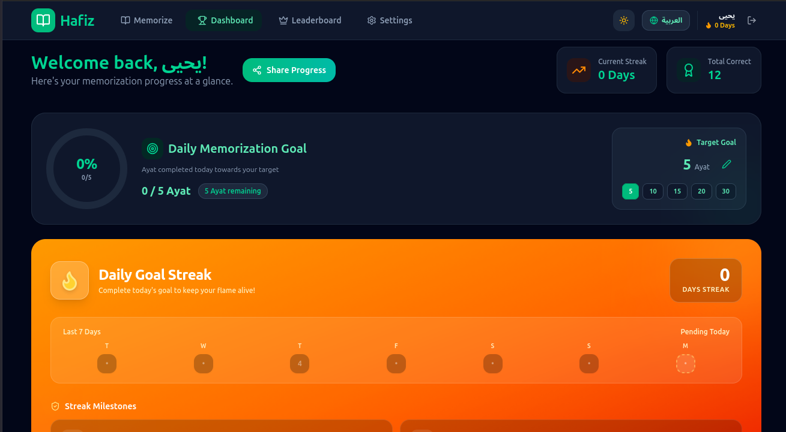 | 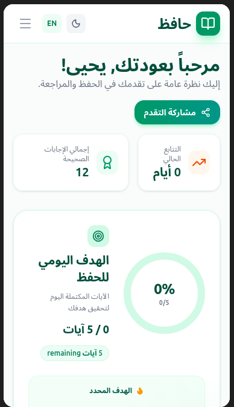 |
| *Desktop view showing daily target progress, streak status, and quick share options* | *Mobile-optimized view in Light mode with quick access to daily goals and stats* |

---

### 2. 🧠 Spaced Repetition (SRS) & Weekly Analytics
Optimize your memory retention with automated review scheduling and detailed weekly performance charts.

| Spaced Repetition (SRS) Review Schedule | Weekly Progress Analytics |
| :---: | :---: |
| 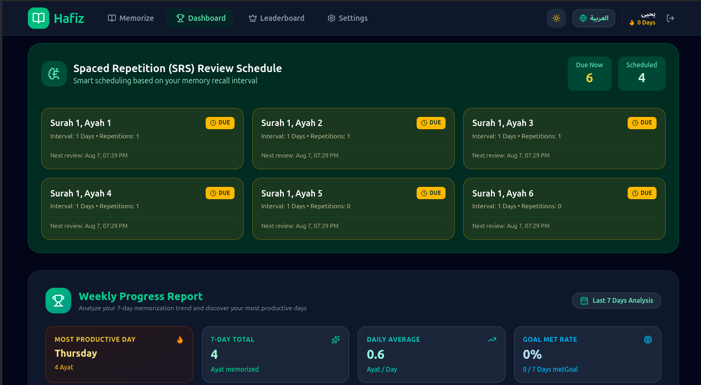 | 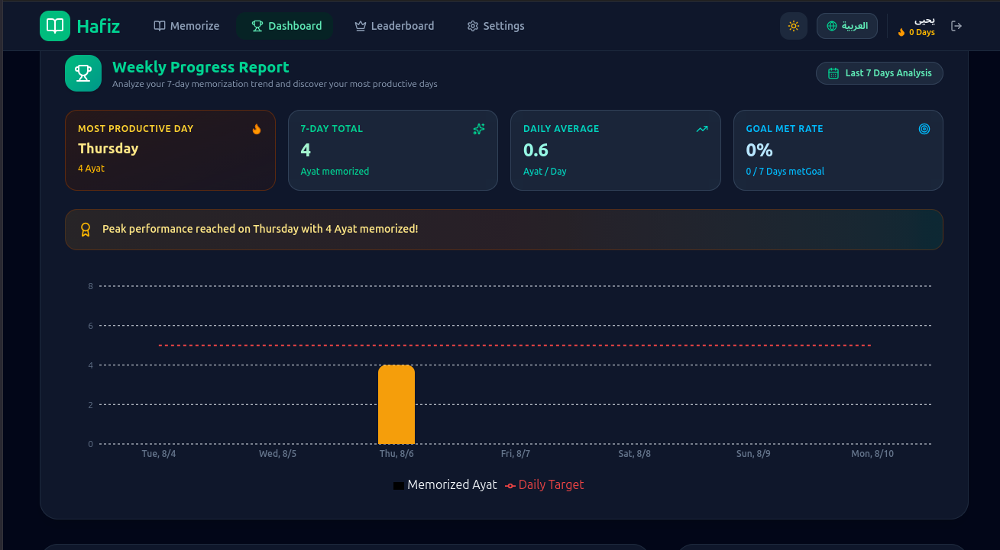 |
| *Automated SRS queue categorizing due and scheduled Ayahs with intervals* | *Recharts visualization of 7-day memorization trends and daily goal completion* |

---

### 3. 🎯 Structured Memorization Plans
Choose from guided pathways tailored to popular Quranic goals or create a custom pace.

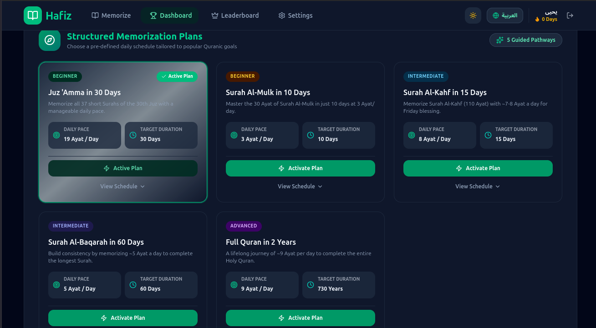
> **Available Pathways**:
> - **Juz 'Amma in 30 Days** (*~19 Ayat / Day*)
> - **Surah Al-Mulk in 10 Days** (*3 Ayat / Day*)
> - **Surah Al-Kahf in 15 Days** (*8 Ayat / Day*)
> - **Surah Al-Baqarah in 60 Days** (*5 Ayat / Day*)
> - **Full Quran in 2 Years** (*9 Ayat / Day*)

---

### 4. 📖 Surah Selector & Smart Quran Search
Search by Surah name, number, reference (`2:255`), or search exact Quranic text with or without diacritics.

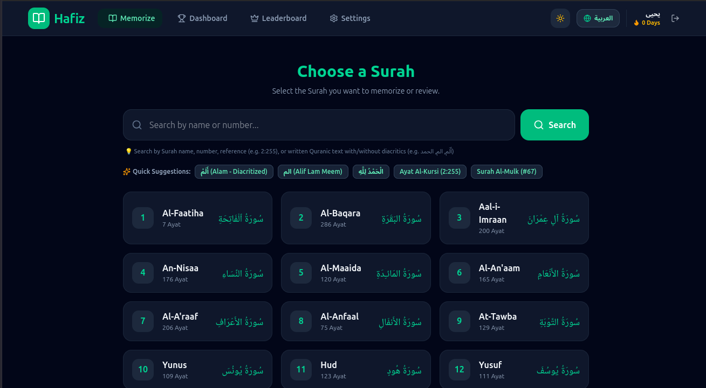
> **Quick Search Suggestions**:
> - `أَلَمْ` (Alam - Diacritized)
> - `الم` (Alif Lam Meem)
> - `الْحَمْدُ لِلَّهِ` (Al-Hamdu lillah)
> - `Ayat Al-Kursi (2:255)`
> - `Surah Al-Mulk (#67)`

---

### 5. 🎯 Practice Modes & Range Selection

| Practice Mode Selection | Ayah Range Selection |
| :---: | :---: |
| 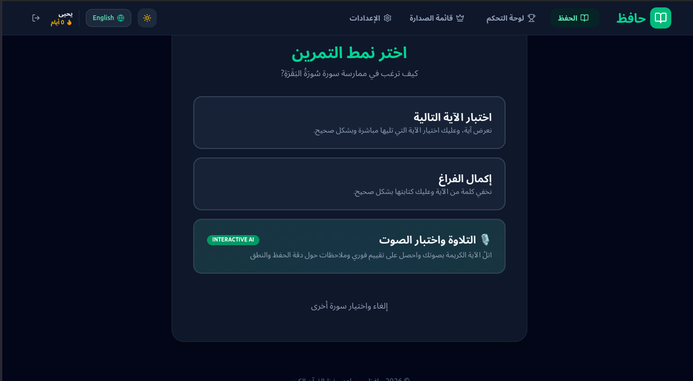 | 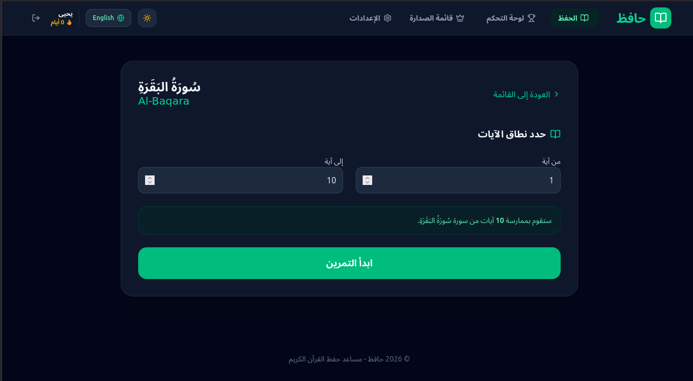 |
| *Choose between Next Ayah Quiz, Fill in the Blank, or AI Voice Recitation* | *Customize the starting and ending Ayah range for focused practice* |

---

### 6. 🎙️ Practice Session & Audio Recitation Player
Interactive recitation player with speed controls (0.75x, 1x, 1.25x), audio repetition loops, and real-time voice feedback.

| Interactive Audio Player & Practice | Voice Recitation Feedback |
| :---: | :---: |
| 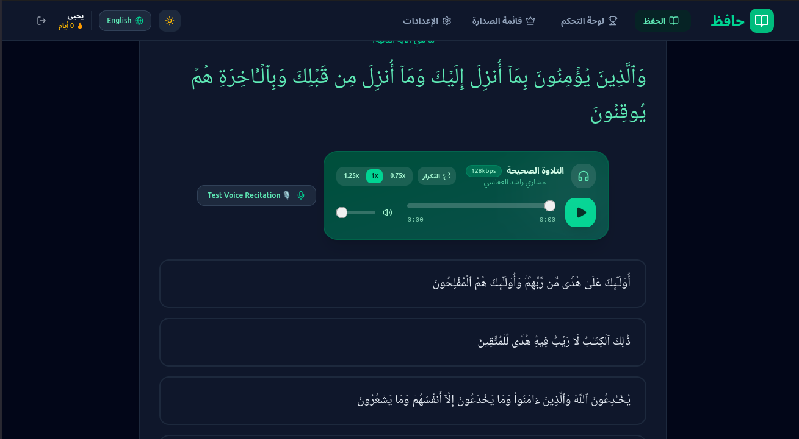 | 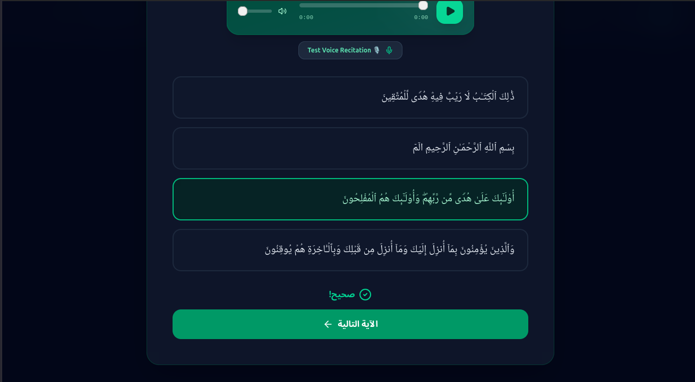 |
| *High-quality audio recitation by Mishary Rashid Alafasy with speed control & loops* | *Multiple-choice verse sequence testing with instant correctness validation* |

---

### 7. 🏆 Global Leaderboard & Session Log
Compete with fellow memorizers and view a detailed log of your past practice sessions.

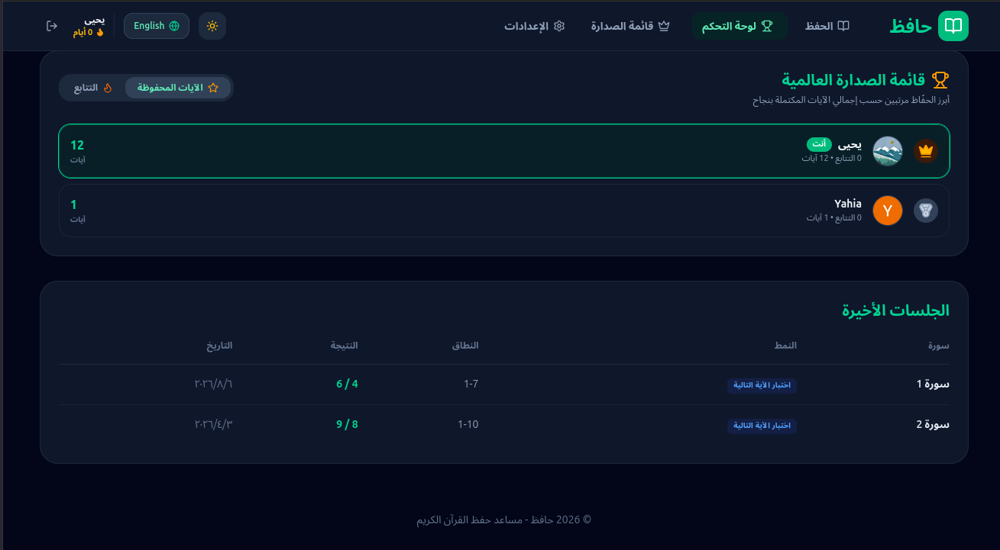

---

## 🚀 Step-by-Step How-To Guides

### 1️⃣ How to Search for a Surah or Specific Verse
1. Navigate to the **Memorize** tab in the main header.
2. In the search bar at the top, enter your query:
   - **Surah Name**: e.g., `Al-Baqara`, `Yasin`, or `الملك`.
   - **Surah Number**: e.g., `67` for Surah Al-Mulk.
   - **Direct Verse Reference**: e.g., `2:255` for Ayat Al-Kursi.
   - **Quranic Text Phrase**: e.g., `الْحَمْدُ لِلَّهِ` or `الم`.
3. Click the **Search** button (or press Enter).
4. View matching Surah cards or instant Ayah text search results.

### 2️⃣ How to Practice & Test Your Memorization
1. Select a Surah from the **Surah Selector**.
2. Specify your desired verse range (e.g., Ayah `1` to `10`) and click **Start Practice**.
3. Select your preferred practice mode:
   - **Next Ayah Quiz**: Test if you know which verse follows the current one.
   - **Fill in the Blank**: Complete missing words in the verse.
   - **Voice Recitation & Speech AI**: Recite aloud into your microphone to verify accuracy.
4. Use the built-in **Audio Player** to listen to authentic recitations, adjust audio speed (`0.75x`, `1x`, `1.25x`), or enable auto-repeat loops.

### 3️⃣ How to Activate a Structured Plan
1. Go to the **Dashboard**.
2. Scroll to the **Structured Memorization Plans** section.
3. Click **Activate Plan** on your chosen pathway (e.g., *Juz 'Amma in 30 Days*).
4. Your daily target will automatically adjust, helping you maintain a consistent memorization routine.

---

## 🛠️ Tech Stack

- **Frontend Framework**: [React 19](https://react.dev/), [TypeScript 5.8](https://www.typescriptlang.org/), [Vite 6](https://vitejs.dev/)
- **UI & Styling**: [Tailwind CSS v4](https://tailwindcss.com/), [Motion / Framer Motion](https://motion.dev/), [Lucide Icons](https://lucide.dev/)
- **Data Visualization**: [Recharts](https://recharts.org/)
- **Backend Services**: [Firebase Firestore](https://firebase.google.com/docs/firestore) & [Firebase Authentication](https://firebase.google.com/docs/auth)
- **API Integration**: [Al Quran Cloud API](https://alquran.cloud/api) for verse audio, text, and search indexing

---

## 💻 Getting Started (Local Development)

### Prerequisites
- **Node.js**: `v18.0.0` or higher
- **npm**: `v9.0.0` or higher

### Setup Instructions

1. **Clone the Repository**:
   ```bash
   git clone https://github.com/your-username/hafiz-quran-app.git
   cd hafiz-quran-app
   ```

2. **Install Dependencies**:
   ```bash
   npm install
   ```

3. **Set Up Environment Variables**:
   Create a `.env` file in the root directory:
   ```env
   VITE_FIREBASE_API_KEY=your_firebase_api_key
   VITE_FIREBASE_AUTH_DOMAIN=your_project.firebaseapp.com
   VITE_FIREBASE_PROJECT_ID=your_project_id
   VITE_FIREBASE_STORAGE_BUCKET=your_project.firebasestorage.app
   VITE_FIREBASE_MESSAGING_SENDER_ID=your_sender_id
   VITE_FIREBASE_APP_ID=your_app_id
   ```

4. **Launch Development Server**:
   ```bash
   npm run dev
   ```
   Open `http://localhost:3000` in your web browser.

5. **Build for Production**:
   ```bash
   npm run build
   ```

---

## 📂 Project Structure

```
hafiz-quran-app/
├── docs/
│   └── screenshots/        # App screenshot documentation
├── src/
│   ├── components/         # React Components
│   │   ├── AyahAudioPlayer.tsx
│   │   ├── DailyMemorizationGoal.tsx
│   │   ├── Dashboard.tsx
│   │   ├── Leaderboard.tsx
│   │   ├── MemorizationPlans.tsx
│   │   ├── Quiz.tsx
│   │   ├── SurahSelector.tsx
│   │   ├── VoiceRecitationFeedback.tsx
│   │   └── WeeklyProgressReport.tsx
│   ├── i18n/               # Localization (Arabic & English)
│   │   └── translations.ts
│   ├── services/           # Quran API & Firebase Services
│   │   └── quranService.ts
│   ├── AuthContext.tsx     # Firebase Auth Provider
│   ├── LanguageContext.tsx # i18n & RTL State Provider
│   ├── ThemeContext.tsx    # Dark/Light Mode Provider
│   ├── App.tsx             # Root Application & Routing
│   └── types.ts            # TypeScript Types & Interfaces
├── metadata.json           # Application Metadata
└── README.md               # Repository Documentation
```

---

## 🤝 Contributing

Contributions are welcome! Please feel free to submit a Pull Request or open an Issue on GitHub.

1. Fork the repository
2. Create your feature branch (`git checkout -b feature/NewFeature`)
3. Commit your changes (`git commit -m 'Add NewFeature'`)
4. Push to the branch (`git checkout -b feature/NewFeature`)
5. Open a Pull Request

---

## 📄 License

This project is licensed under the MIT License - see the [LICENSE](LICENSE) file for details.

